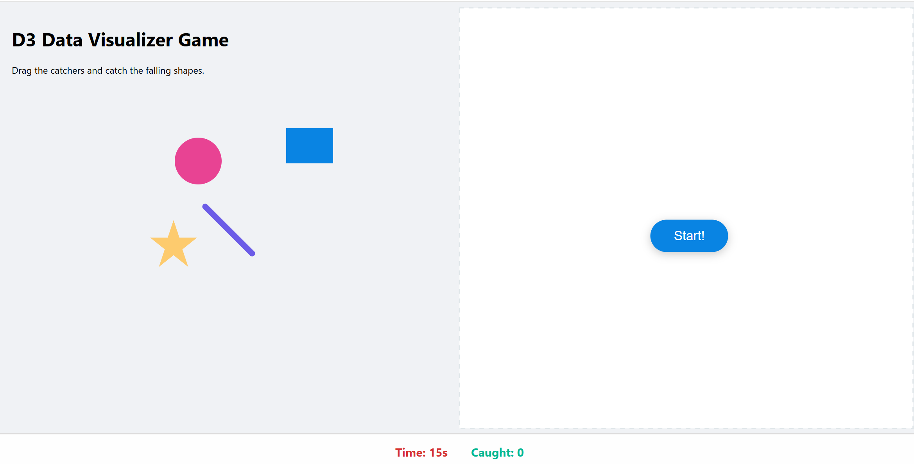
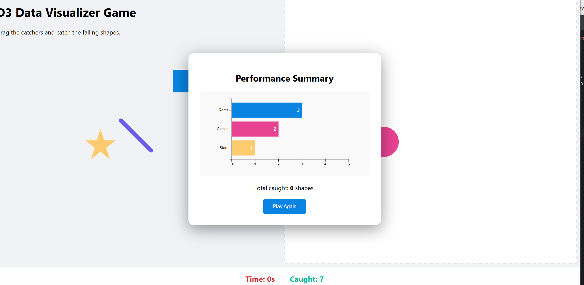

Assignment 1 - Hello World: GitHub and d3  
===

This project is a web-based interactive visualization built with D3.js. On the left side of the canvas, I create four required SVG primitives. And On the right side, there is a short 15-second mini-game runs in which randomly generated shapes fall from the top of the screen. Users can drag the primitives to catch these shapes.

Live link
===
https://yunynl.github.io/a1-ghd3/

Screenshots
===
1.
2.

Technical Achievements
===
To support interactive gameplay, I built a collision detector that runs during each falling object’s animation. By comparing the bounding boxes  of falling SVG elements with those of the draggable primitives, the system can detect overlaps in real time. This approach allows all four primitive types to function as collectors.

Design Achievements
===
To make interactions feel more responsive, I added subtle visual feedback during user actions. The cursor changes when hovering over draggable elements, and visual states update. 